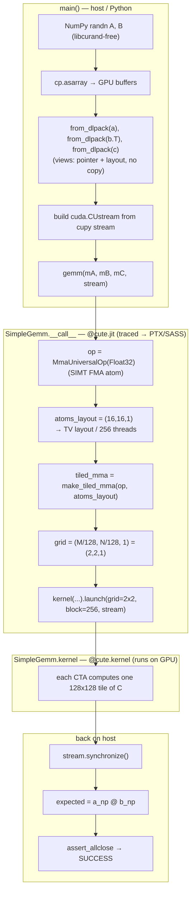
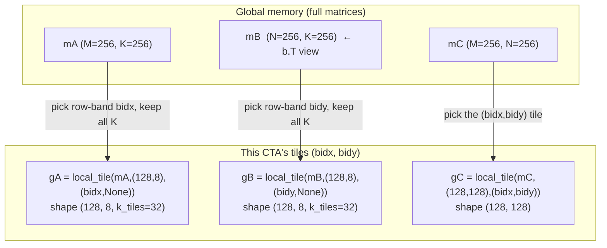
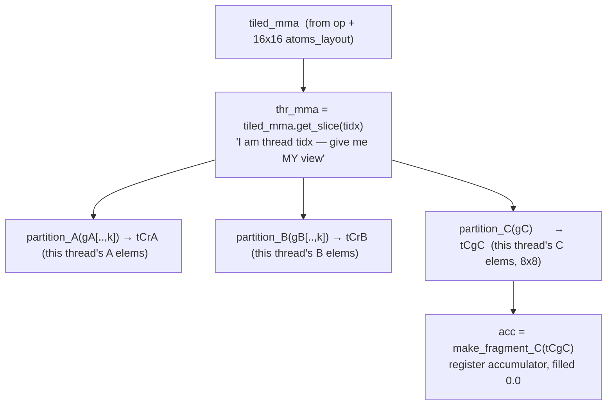
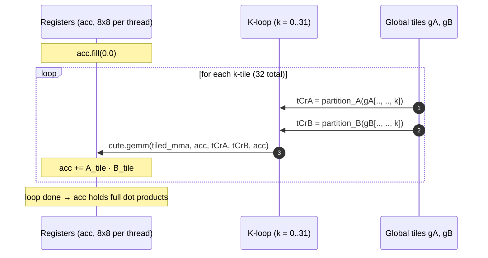
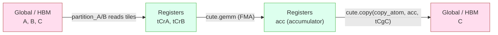
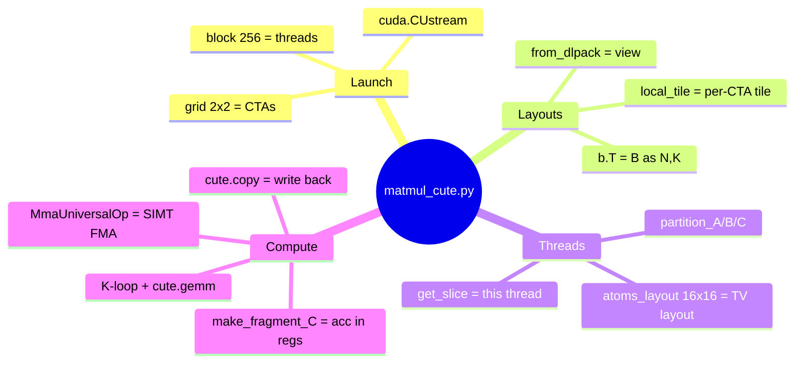

# `matmul_cute.py` — Visual Walkthrough (Mermaid)

Diagrams of how the SIMT GEMM in `matmul_cute.py` actually executes, from host
setup down to per-thread work. Pair with `learning.md`.

Problem: `C[256,256] = A[256,256] @ B[256,256]`, tiles `128×128×8`, `256` threads/CTA.

---

## 1. End-to-end flow (host → device → verify)

---

## 2. Grid decomposition — which CTA owns which part of C

`grid = (2, 2)` → 4 CTAs, each owns a `128×128` tile of the `256×256` output.

```mermaid
flowchart LR
    subgraph C["C  (256 x 256)"]
        direction TB
        subgraph R0[" "]
            T00["CTA (0,0)<br/>rows 0-127<br/>cols 0-127"]
            T01["CTA (0,1)<br/>rows 0-127<br/>cols 128-255"]
        end
        subgraph R1[" "]
            T10["CTA (1,0)<br/>rows 128-255<br/>cols 0-127"]
            T11["CTA (1,1)<br/>rows 128-255<br/>cols 128-255"]
        end
    end
    note["bidx = row-tile index&#10;bidy = col-tile index"] -.-> C
```

Each CTA: `bidx, bidy = block_idx()` → it knows exactly its 128×128 region.

---

## 3. Tiling the global tensors with `local_tile`

For CTA `(bidx, bidy)`, the three operands are sliced into per-CTA tiles.
Note B is passed as `(N, K)` (the `b.T` view) so its K mode is trailing.

`k_tiles = 256 / 8 = 32` → the third mode is the K-loop iteration count.

---

## 4. TV layout — how 256 threads partition the 128×128 tile

`atoms_layout = (16,16,1)` arranges threads as a 16×16 grid. Each thread owns an
`8×8` sub-block of the output tile (`128/16 = 8`).

> This TV layout is the answer to "which thread/warp does what" — change
> `atoms_layout` and you change the assignment. Warp `w` = threads `32w..32w+31`.

---

## 5. The K-loop — accumulate across the contraction dim

Contraction: `acc[m,n] += Σ_k A[m,k] · B[n,k]`. Because B is `(N,K)`,
`B[n,k] = b[k,n]`, so this equals `(a @ b)[m,n]`. ✅

---

## 6. Memory journey of the data

> ⚠️ This basic version goes **global → registers → global** with no shared-
> memory stage, so A/B tiles get re-read from slow HBM. The fast version inserts
> an SMEM tile (`SmemAllocator` + `cp.async`) between HBM and registers, and uses
> tensor cores instead of FMA. See `learning.md` Stages 3–4.

---

## 7. Concept → code map

---

*Render these in any Mermaid-aware viewer (GitHub, VS Code Mermaid preview, Obsidian).*
